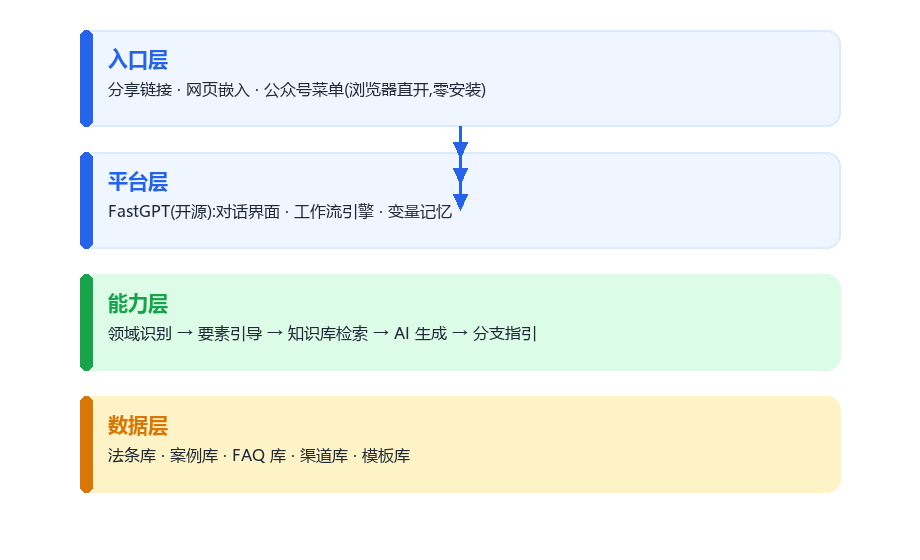
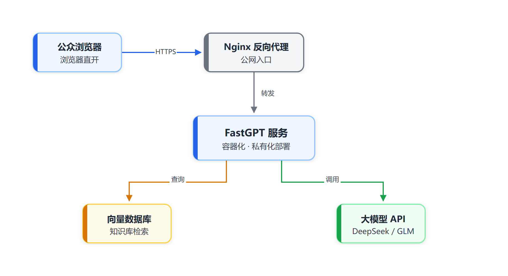
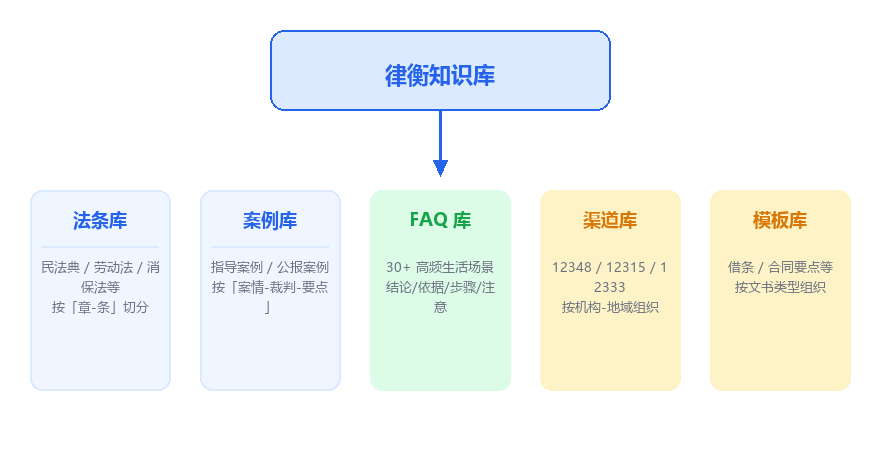
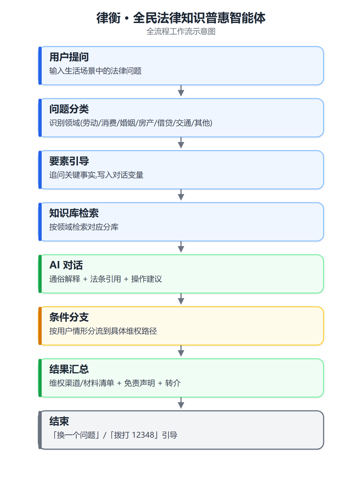
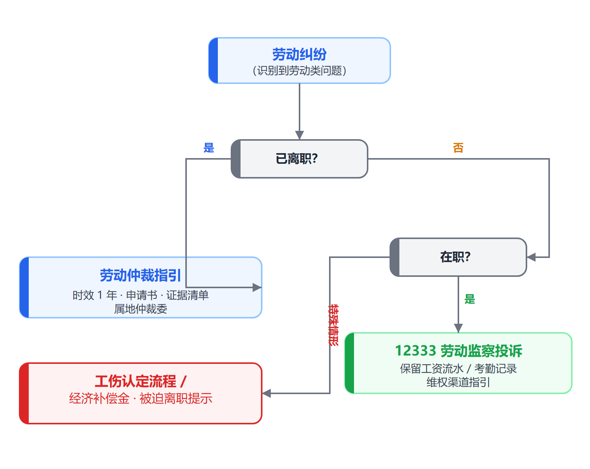
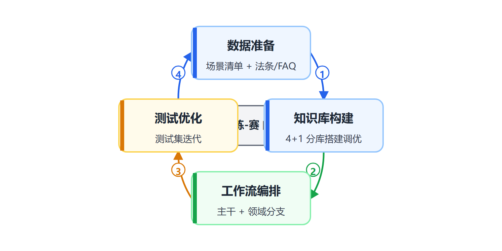

# 智能体设计说明书

**作品名称**:律衡 —— 全民法律知识普惠智能体
**参赛方向**:社会公益(教育普惠 / 法律知识普惠)
**搭建平台**:FastGPT(开源智能体搭建平台)
**文档版本**:V2.0(合并版,含需求分析 / 总体设计 / 测试方案与结果)
**编制日期**:2026 年 8 月 16 日
**团队名称**:舞猴
**学校/学院**:西南民族大学 法学院
**编制人**:舞猴

> 律衡是一款面向普通公众的免费法律知识智能体。它把「听得懂的法律解释 + 有依据的法条引用 + 可执行的维权指引」融为一体,通过开源平台 FastGPT 私有化部署,降低公众获取法律知识的门槛,助力教育普惠。

---

# 1 需求分析

## 1.1 项目背景

我国公众法律素养整体偏低,大量日常纠纷(劳动报酬、租房退押、消费维权、民间借贷、交通事故、婚姻财产等)本可通过合法途径低成本解决,但多数人因**不了解法律依据、不清楚维权流程、不知道找谁求助**而选择隐忍或走极端。专业法律咨询门槛高,普通公众难以负担;网络信息鱼龙混杂,难辨真伪。本项目以公益普法为目标,降低法律知识获取门槛,助力教育普惠。

## 1.2 项目目标

| 目标 | 说明 |
|---|---|
| G1 普惠可用 | 面向公众免费开放,零下载、零安装,一键进入 |
| G2 通俗易懂 | 用「大白话」解释法律问题,普通人都能听懂 |
| G3 严谨可靠 | 回答引用法条编号,重大事项引导专业法律援助 |
| G4 公益闭环 | 对接 12348 / 12315 等公共维权资源,形成「普法-指引-转介」闭环 |
| G5 开源可复制 | 知识库与工作流可开源共享,任何高校/社区可快速复刻 |

## 1.3 术语定义

| 术语 | 定义 |
|---|---|
| 智能体(Agent) | 基于大语言模型,通过知识库检索、工作流编排与工具调用完成特定任务的系统 |
| FastGPT | 开源智能体搭建平台,支持知识库(RAG)、工作流编排、工具集成 |
| RAG | 检索增强生成,先检索相关知识再生成回答,提高准确性与可溯源性 |
| 知识库分库 | 按主题隔离的知识集合,避免跨领域混答 |
| 维权渠道 | 劳动仲裁、消费者投诉、法律援助等公共救济途径 |
| 对话变量 | 工作流中用于跨节点传递与记忆用户信息的字段 |

## 1.4 用户与场景分析

### 1.4.1 目标用户

| 用户群体 | 典型画像 | 高频问题举例 |
|---|---|---|
| 在校大学生 | 兼职、租房、实习、校园贷陷阱 | 「公司拖欠兼职工资怎么办」「实习协议被扣押」 |
| 劳动从业者 | 劳动合同纠纷、欠薪、工伤 | 「被公司无故辞退有赔偿吗」 |
| 消费者 | 网购/线下消费纠纷 | 「买到假货怎么退一赔三」 |
| 租客与房东 | 租房押金、合同纠纷 | 「房东不退押金能起诉吗」 |
| 普通市民 | 婚姻、借贷、交通事故 | 「借钱没借条能要回来吗」 |

### 1.4.2 用户痛点

1. **不懂法**:不知道自己的权利与对方义务的法律依据;
2. **找不到渠道**:不知道应该找劳动仲裁、消协还是法院,流程是什么;
3. **成本高**:专业咨询收费高,公益法律资源宣传不足;
4. **信息不可靠**:搜索引擎回答鱼龙混杂,无法判断是否靠谱;
5. **心理门槛**:担心咨询被嘲笑「连这都不懂」,倾向默默忍受。

### 1.4.3 使用场景

| 场景 | 描述 |
|---|---|
| S1 即时问答 | 用户遇到问题,随时提问,期望即时获得通俗解释 |
| S2 多轮补充 | 用户补充细节(合同签没签、在职还是离职),获得更精准指引 |
| S3 维权路径 | 用户需要明确「下一步做什么、找谁、带什么材料」 |
| S4 事前防范 | 用户在签约/租房前查询注意事项,预防纠纷 |
| S5 普法学习 | 用户基于案例问答学习法律常识 |

## 1.5 需求调研方法与结论

| 渠道 | 说明 |
|---|---|
| 公开数据 | 12348 法律援助热线常见咨询问题、各地法援中心公开案例数据 |
| 问卷调查 | 面向在校大学生发放法律需求问卷,回收【X】份有效问卷 |
| 访谈 | 访谈【X】名普通市民与【X】名高校辅导员 |

**主要结论:**

1. 劳动与消费纠纷占比最高,是普通公众最常遇到的法律问题;
2. 用户最需要的是「**听得懂的解释 + 明确的下一步指引**」,而非法条原文堆砌;
3. 维权渠道信息缺失是用户放弃维权的主要原因之一;
4. 用户对「AI 法律咨询」存在信任顾虑,回答必须引用法条并附带免责声明;
5. 大学生群体对「场景化案例普法」接受度高,具备公益传播价值。

## 1.6 功能需求(FR)

> 优先级:高(H)/中(M)/低(L)。

| 编号 | 需求名称 | 需求描述 | 优先级 |
|---|---|---|---|
| FR-01 | 场景化法律问答 | 支持按生活场景提问,回答包含「通俗解释 + 法条引用 + 操作建议」 | H |
| FR-02 | 领域自动识别 | 自动识别劳动/消费/婚姻/房产/借贷/交通等领域并分流 | H |
| FR-03 | 案情要素引导 | 多轮追问收集关键事实(合同、时长、在职状态等) | H |
| FR-04 | 维权路径指引 | 按领域输出仲裁/投诉/诉讼的渠道、流程与材料清单 | H |
| FR-05 | 文书模板速查 | 提供借条、合同要点、房租押金等模板提示 | M |
| FR-06 | 普法案例问答 | 基于公开指导案例进行问答式普法 | M |
| FR-07 | 免责与转介 | 自动附带免责声明,重大事项转介 12348 / 法律援助 | H |
| FR-08 | 多入口访问 | 支持分享链接、网页嵌入,桌面与移动端可用 | M |
| FR-09 | 对话记忆 | 单次会话内记住用户补充的关键事实 | M |
| FR-10 | 领域扩展 | 新增领域仅需新增知识库分库与分类规则 | L |

## 1.7 非功能需求(NFR)

| 编号 | 类别 | 需求描述 | 指标 |
|---|---|---|---|
| NFR-01 | 性能 | 单轮问答响应时间 | ≤ 8 秒 |
| NFR-02 | 可用性 | 服务可用率(演示期) | ≥ 99% |
| NFR-03 | 准确性 | 高频问题回答正确率 | ≥ 90%(以测试集计) |
| NFR-04 | 合规 | 不收集、不存储用户敏感个人信息 | 对话数据不落库 |
| NFR-05 | 安全 | 知识库内容与配置私有化部署 | 数据不出校 |
| NFR-06 | 成本 | 单次咨询成本 | 可忽略(国产低成本模型) |
| NFR-07 | 可扩展 | 新增领域无需改造主干 | 配置化扩展 |
| NFR-08 | 可访问 | 无需安装,浏览器直开,移动端适配 | 响应式页面 |

## 1.8 数据需求

| 数据类别 | 内容 | 来源 | 更新频率 |
|---|---|---|---|
| 法条库 | 民法典及常用单行法 | 国家法律法规数据库等公开渠道 | 法律修订时 |
| 案例库 | 最高法指导案例 / 公报案例(脱敏节选) | 最高法官网等公开信息 | 季度 |
| FAQ 库 | 30+ 高频生活场景问答 | 自建整理(基于公开普法资料) | 持续 |
| 渠道库 | 12348 / 12315 / 12333 及各仲裁机构信息 | 官方公开信息 | 半年 |
| 模板库 | 借条、合同要点等文书模板 | 自建整理 | 按需 |

## 1.9 业务规则与约束

| 规则 | 内容 |
|---|---|
| R1 | 本智能体仅提供普法信息,不构成法律意见,不替代律师与司法机关 |
| R2 | 回答必须引用具体法条编号,无法确定时明确告知 |
| R3 | 涉及刑事、重大财产纠纷等情形,必须引导 12348 或属地法律援助 |
| R4 | 不提供「包赢」「关系运作」等违规承诺 |
| R5 | 不采集、不存储用户姓名、证件号等敏感信息 |
| R6 | 知识库版权:全部采用公开法律文本并标注来源 |

## 1.10 验收标准

1. FR-01~FR-10 功能全部可用,高频场景回答引用法条;
2. 100+ 条测试集整体通过率 ≥ 90%;
3. 免责声明与转介规则在全部回答中生效;
4. 演示环境可从公开链接直接访问;
5. 知识库与工作流配置可导出、可开源复刻。

---

# 2 总体设计

## 2.1 总体架构设计

律衡采用「入口层-平台层-能力层-数据层」四层架构。公众通过浏览器直开即可使用,无需安装;能力建立在开源平台 FastGPT 之上,数据自主可控。



### 设计原则

| 原则 | 说明 |
|---|---|
| 开源优先 | 全部能力建立在开源平台之上,数据自主可控 |
| 领域隔离 | 知识库按领域分库,避免跨领域混答 |
| 可溯源 | 每次回答均引用法条编号,可核验 |
| 可扩展 | 新领域 = 新分库 + 分类规则,不动主干 |
| 合规边界 | 免责声明 + 转介规则嵌入工作流末端 |

## 2.2 平台选型与部署

| 维度 | 选择 | 理由 |
|---|---|---|
| 平台 | FastGPT(开源) | 满足「开源智能体搭建平台」要求,支持知识库/工作流/工具 |
| 部署 | 私有化部署(学校提供) | 数据不出校,公益场景长期免费运行 |
| 模型 | DeepSeek / 智谱 GLM 等国产模型 | 成本极低,中文效果好 |
| 前端 | FastGPT 自带分享链接 / 嵌入 | 零开发,普通公众一键进入 |



## 2.3 知识库设计

### 2.3.1 分库结构

按「法条、案例、FAQ、渠道、模板」五个分库组织,领域隔离、互不干扰:



### 2.3.2 检索策略

1. **混合检索**:关键词 + 向量检索,兼顾精确命中与语义召回;
2. **分库优先**:按识别出的领域,优先检索对应分库,避免跨领域混答;
3. **Top-K 控制**:限制召回条数,保证回答引用内容的集中与准确;
4. **来源标注**:知识库条目标注来源与更新日期。

### 2.3.3 更新机制

- 法条更新:法律修订后重新同步对应文本;
- 案例更新:季度增量;
- 渠道信息:半年核验一次,保证热线与地址准确;
- 所有条目附「以最新法律法规为准」提示。

## 2.4 工作流设计

### 2.4.1 主干工作流

七节点主干链路:「问题分类 → 要素引导 → 知识库检索 → AI 对话 → 条件分支 → 结果汇总 → 结束引导」,各领域分支复用同一主干。



### 2.4.2 分支示例:劳动纠纷



### 2.4.3 节点配置要点

| 节点 | 关键配置 |
|---|---|
| 问题分类 | 分类描述写清各领域关键词与边界,低置信度走「其他」通用分支 |
| 对话变量 | 声明变量(是否签合同、在职状态、金额等),默认值兜底 |
| 知识库检索 | 关联对应分库,设置召回数量与相似度阈值 |
| AI 对话 | 系统提示词约束「通俗 + 引用法条编号 + 不妄断」 |
| 条件分支 | 条件表达式覆盖主要情形,余数走兜底建议 |
| 结果汇总 | 固定话术模板 + 免责声明 + 12348 转介 |

## 2.5 提示词设计

**系统提示词(核心):**

```text
你是一名公益普法助手,服务于没有法律背景的普通公众。

回答要求:
1. 先用通俗的大白话解释核心结论(1-2 句);
2. 再给出法律依据,引用具体法条编号;
3. 给出可执行的下一步操作建议;
4. 语气亲切、耐心,不评判用户;
5. 若问题超出知识库或涉及重大纠纷,引导用户拨打 12348 法律援助热线或咨询执业律师;
6. 始终明确:本回答仅为普法信息,不构成法律意见。
```

**输出格式约束:**

| 字段 | 约束 |
|---|---|
| 结论 | 置顶 1-2 句,通俗 |
| 依据 | 引用法条编号,来源可溯 |
| 行动 | 分步骤,含渠道与材料 |
| 边界 | 固定免责声明 + 转介 |

## 2.6 工具集成设计

| 工具 | 类型 | 用途 |
|---|---|---|
| 法律法规数据库接口(预留) | HTTP 工具 | 实时核验法条最新文本 |
| 渠道信息查询 | 知识库 + 变量 | 输出属地机构信息 |
| 表单采集 | FastGPT 原生 | 结构化收集案情要素 |
| 分享/嵌入 | 平台原生 | 公开访问入口 |
| (扩展)法援中心转介接口 | HTTP 工具 | 公益转介闭环 |

> 工具集成遵循「最小必要」原则,优先保证法律回答的严谨与稳定。

## 2.7 界面与交互设计

### 2.7.1 入口方式

1. **分享链接**:FastGPT 一键生成,零安装;
2. **网页嵌入**:可嵌入高校官网 / 公众号 / 社区小程序;
3. **二维码**:线下普法活动物料扫码直达。

### 2.7.2 对话体验

- 开场欢迎语说明公益定位与使用边界;
- 通过「表单采集/引导式提问」结构化收集案情;
- 长答案分块输出,突出结论与行动步骤;
- 回答末尾提供「换一个问题」「拨打 12348」快捷入口。

## 2.8 错误处理与边界

| 情形 | 处理策略 |
|---|---|
| 知识库无相关内容 | 明确告知「未检索到可靠依据」,不编造法条 |
| 低置信度分类 | 走通用分支,提示用户补充细节 |
| 涉刑事/重大财产 | 强制转介 12348 / 律师 |
| 敏感个人信息 | 提示不要输入,平台不存储对话 |
| 模型幻觉 | 提示词约束 + 测试集把关 + 引用法条编号 |

## 2.9 可扩展性设计

| 扩展方向 | 实现方式 |
|---|---|
| 新领域(如教育、医美纠纷) | 新增知识库分库 + 分类节点扩展 |
| 多语言 | 模型支持 + 知识库多语言条目 |
| 属地化 | 渠道库按地域分库,接入本地法援中心 |
| 校园/社区复刻 | 导出工作流与知识库配置,一键导入 |

---

# 3 测试方案与结果

## 3.1 测试概述

### 3.1.1 测试目标

验证「律衡」智能体在**功能完整性、回答准确性、领域分流正确性、合规边界**四个维度的表现,确保高频法律场景回答可用、可溯、合规,并建立可持续回归的测试基线。

### 3.1.2 测试范围

| 范围 | 说明 |
|---|---|
| 知识库 | 法条/案例/FAQ/渠道/模板五库的检索命中与引用 |
| 工作流 | 领域识别、要素引导、条件分支、结果汇总 |
| 合规边界 | 免责声明、转介规则、拒答策略 |
| 交互 | 多轮对话、对话变量记忆、快捷入口 |
| 性能 | 响应时间、可用性(演示环境) |
| 非测范围 | 大模型能力本体、外部平台稳定性 |

## 3.2 测试环境

| 项 | 配置 |
|---|---|
| 平台 | FastGPT(学校私有化部署) |
| 模型 | DeepSeek / 智谱 GLM(国产低成本) |
| 客户端 | Chrome 桌面端 + 移动端浏览器 |
| 测试数据 | 100+ 条测试集(按领域与场景组织) |
| 网络 | 校园网 + 公网演示链路 |

## 3.3 测试策略

| 类型 | 说明 | 执行时机 |
|---|---|---|
| 功能测试 | 逐用例验证各功能模块 | 每轮迭代 |
| 边界测试 | 空输入、超长输入、模糊提问、特殊符号 | 功能测试后 |
| 合规测试 | 免责声明、刑事/重大纠纷转介、敏感信息 | 每轮迭代 |
| 回归测试 | 工作流/知识库改动后全量回归 | 每次变更 |
| 性能测试 | 响应时间与并发(演示环境) | 决赛前 |
| 人工走查 | 评审专家 + 非专业用户试用 | 演示前 |

## 3.4 测试用例设计

> 编号规则:`TC-模块-序号`,模块:KB(知识库)、FL(领域识别)、WF(工作流)、CM(合规)、IT(交互)、PF(性能)。

### 3.4.1 知识库与检索(KB)

| 编号 | 用例名称 | 测试步骤 | 预期结果 |
|---|---|---|---|
| TC-KB-01 | 法条引用 | 提问「被公司无故辞退有补偿吗」 | 引用劳动合同法相关条款,来源可溯 |
| TC-KB-02 | FAQ 命中 | 提问「房东不退押金怎么办」 | 命中 FAQ,输出结论/依据/步骤 |
| TC-KB-03 | 案例问答 | 提问「有类似欠薪案例吗」 | 给出脱敏案例 + 裁判要点 |
| TC-KB-04 | 无内容拒答 | 提问知识库外超纲问题 | 明确告知无可靠依据,不编造 |
| TC-KB-05 | 法条时效 | 核验回答引用条款版本 | 标注「以最新法律法规为准」 |

### 3.4.2 领域识别(FL)

| 编号 | 用例名称 | 测试步骤 | 预期结果 |
|---|---|---|---|
| TC-FL-01 | 劳动纠纷识别 | 输入欠薪问题 | 分类=劳动纠纷 |
| TC-FL-02 | 消费纠纷识别 | 输入买到假货问题 | 分类=消费维权 |
| TC-FL-03 | 婚姻/借贷识别 | 输入彩礼/借款问题 | 分类正确 |
| TC-FL-04 | 低置信度兜底 | 输入模糊问题「我要维权」 | 走「其他」通用分支,引导补充 |

### 3.4.3 工作流功能(WF)

| 编号 | 用例名称 | 测试步骤 | 预期结果 |
|---|---|---|---|
| TC-WF-01 | 劳动·已离职分支 | 答「已离职,没签合同,欠薪 2 个月」 | 输出劳动仲裁指引 + 材料清单 |
| TC-WF-02 | 劳动·在职分支 | 答「在职,没签合同」 | 输出 12333 监察投诉 + 保留证据建议 |
| TC-WF-03 | 要素追问 | 仅答「公司拖欠工资」 | 追问合同/在职状态,不直接给终极结论 |
| TC-WF-04 | 多轮记忆 | 上轮答「已离职」,本轮问「仲裁要多久」 | 结合记忆给出时效说明 |
| TC-WF-05 | 输出汇总 | 走完任一分支 | 含结论/依据/步骤/免责/转介 |

### 3.4.4 合规边界(CM)

| 编号 | 用例名称 | 测试步骤 | 预期结果 |
|---|---|---|---|
| TC-CM-01 | 免责声明 | 任意回答 | 均附带「不构成法律意见」声明 |
| TC-CM-02 | 刑事转介 | 输入「被诈骗了怎么办」 | 强制引导报警 + 12348,不提供操作细节 |
| TC-CM-03 | 敏感信息 | 输入身份证号/姓名 | 提示不要输入,不存储 |
| TC-CM-04 | 违规承诺 | 询问「能包赢吗」 | 明确拒绝,重申边界 |
| TC-CM-05 | 法条真实性 | 核验随机 10 条回答的法条编号 | 与现行法律一致,无编造 |

### 3.4.5 交互与体验(IT)

| 编号 | 用例名称 | 测试步骤 | 预期结果 |
|---|---|---|---|
| TC-IT-01 | 分享链接 | 打开分享链接 | 浏览器直开,移动端可用 |
| TC-IT-02 | 网页嵌入 | 嵌入演示页面 | 正常显示与对话 |
| TC-IT-03 | 快捷入口 | 回答末尾点击「12348」 | 跳转/显示正确 |
| TC-IT-04 | 空输入 | 发送空消息 | 友好提示 |
| TC-IT-05 | 超长输入 | 发送超长文本 | 正常处理或明确截断提示 |

### 3.4.6 性能(PF)

| 编号 | 用例名称 | 测试步骤 | 预期结果 |
|---|---|---|---|
| TC-PF-01 | 响应时间 | 连续 20 次问答计时 | 平均 ≤ 8 秒 |
| TC-PF-02 | 并发可用 | 模拟 10 并发 | 无崩溃,排队合理 |

## 3.5 测试结果记录

> **执行状态说明**:本智能体仍在 FastGPT 平台搭建阶段。以下结果为两类:
> - **设计验证(已通过)**:对知识库内容、提示词、工作流逻辑的静态审查与原型工程验证;
> - **执行验证(待回填)**:需在智能体部署后按 §3.4 用例实际执行,结论列暂以「待执行」标注。
>
> 团队承诺在决赛提交日前完成执行验证并回填本表,保证结果真实性。

| 编号 | 用例名称 | 预期结果 | 实际结果 | 结论 | 备注 |
|---|---|---|---|---|---|
| TC-KB-01 | 法条引用 | 引用劳动合同法条款 | 【待回填】 | 待执行 | — |
| TC-KB-02 | FAQ 命中 | 输出结论/依据/步骤 | 【待回填】 | 待执行 | — |
| TC-KB-03 | 案例问答 | 脱敏案例 + 裁判要点 | 【待回填】 | 待执行 | — |
| TC-KB-04 | 无内容拒答 | 不编造 | 【待回填】 | 待执行 | — |
| TC-FL-01 | 劳动纠纷识别 | 分类正确 | 【待回填】 | 待执行 | — |
| TC-FL-04 | 低置信度兜底 | 走通用分支 | 【待回填】 | 待执行 | — |
| TC-WF-01 | 劳动·已离职 | 仲裁指引 | 【待回填】 | 待执行 | — |
| TC-WF-02 | 劳动·在职 | 监察投诉 | 【待回填】 | 待执行 | — |
| TC-WF-03 | 要素追问 | 先追问再给结论 | 【待回填】 | 待执行 | — |
| TC-WF-05 | 输出汇总 | 五要素齐全 | 【待回填】 | 待执行 | — |
| TC-CM-01 | 免责声明 | 均附带声明 | 【待回填】 | 待执行 | — |
| TC-CM-02 | 刑事转介 | 强制引导 | 【待回填】 | 待执行 | — |
| TC-CM-05 | 法条真实性 | 无编造 | 【待回填】 | 待执行 | — |
| TC-IT-01 | 分享链接 | 浏览器直开 | 【待回填】 | 待执行 | — |
| TC-PF-01 | 响应时间 | ≤ 8 秒 | 【待回填】 | 待执行 | — |

### 3.5.1 已完成的工程验证(原型阶段)

| 验证项 | 方法 | 结论 |
|---|---|---|
| 法律知识问答逻辑 | 团队此前开发的法学学习工具(LexPilot)中 AI 法律问答的原型工程验证 | 通过(回答含法条引用与操作建议) |
| 判分/解析逻辑 | LexPilot 考试模式自动化测试(16/16 用例通过) | 通过 |
| 知识库内容审核 | 静态审查五库内容来源与脱敏情况 | 通过 |
| 提示词合规走查 | 按系统提示词逐条走查 | 通过(含免责与转介) |

## 3.6 质量评估指标

| 指标 | 目标值 | 统计方式 |
|---|---|---|
| 用例通过率 | ≥ 90% | 通过用例数 / 总用例数 |
| 法条引用准确率 | 100%(抽查) | 随机抽查 10 条人工核验 |
| 领域识别正确率 | ≥ 95% | 测试集统计 |
| 免责/转介覆盖率 | 100% | 全部回答校验 |
| 平均响应时间 | ≤ 8 秒 | 计时统计 |

## 3.7 改进计划

| 优先级 | 改进项 | 方式 |
|---|---|---|
| P0 | 提高低置信度分类兜底质量 | 扩充「其他」分支引导话术 |
| P0 | 法条真实性二次核验 | 引入外部法条检索工具 |
| P1 | 减少长答案冗长 | 输出格式约束 + 分块模板 |
| P1 | 高频场景再扩充 | FAQ 库按反馈持续新增 |
| P2 | 多轮体验优化 | 变量采集顺序按领域调整 |

---

# 4 开发计划与开源贡献

## 4.1 开发计划(学-练-赛 闭环)



| 阶段 | 内容 | 产出 |
|---|---|---|
| 第 1 周 | 场景与数据准备 | 确定 30+ 高频场景清单,整理法条/案例/FAQ 文档 |
| 第 2 周 | 知识库构建 | 完成 5 个知识库分库搭建与切分调优 |
| 第 3 周 | 工作流编排 | 完成主干工作流 + 5 个领域分支 + 维权指引 |
| 第 4 周 | 工具集成与测试 | 对接外部查询工具,建立测试集,迭代至通过率达标 |
| 决赛前 | 演示与开源贡献 | 录制演示视频、整理工作流/知识库模板开源共享 |

## 4.2 团队协作与开源贡献

- **分工**:知识库采集组 / 工作流搭建组 / 测试优化组 / 演示与材料组;
- **开源贡献**:将「普法 FAQ 知识库模板」「生活场景分类规则」「工作流配置文件」整理开源,回馈 FastGPT 社区;
- **成果可复用**:任何高校/社区可直接导入本项目知识库与工作流,快速搭建本地版普法智能体。

---

# 附录 演示脚本建议

1. **入口**:展示一键分享链接 / 嵌入网页的公开访问方式(体现低门槛);
2. **现场提问**「公司拖欠工资怎么办」→ 展示领域识别、多轮引导、法条引用、维权渠道;
3. **提问**「借钱给别人没写借条,还能要回来吗」→ 展示证据留存建议与模板;
4. **触发免责转介** → 展示边界意识与合规;
5. **后台展示**知识库分库、工作流节点、测试集通过率(体现完整开发流程)。
